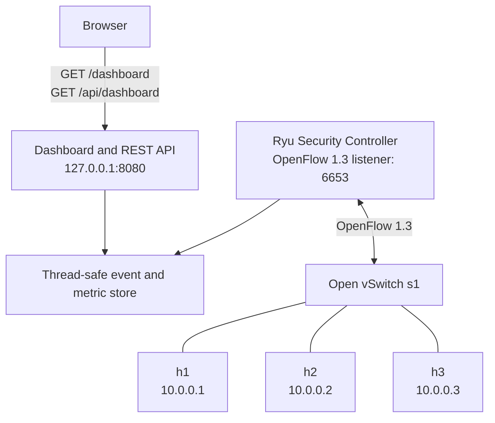
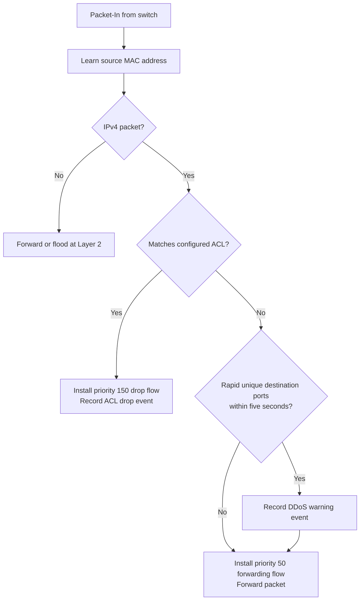

# SDN Security Aspects

[](https://www.python.org/)
[](https://ryu-sdn.org/)
[](https://opennetworking.org/software-defined-standards/specifications/)
[](https://mininet.org/)
[](https://www.openvswitch.org/)

A Software-Defined Networking security lab built with a Ryu OpenFlow controller, a three-host Mininet topology, and a real-time web dashboard. The controller learns Layer 2 forwarding paths, blocks a configured SSH flow with an ACL rule, and flags rapid destination-port scanning as suspicious activity.

## Architecture



The Ryu process serves the dashboard and REST API locally on port `8080`. Mininet starts an Open vSwitch instance that connects to the controller on port `6653`.

## Security Behavior



| Capability | Implementation |
| --- | --- |
| Layer 2 switching | MAC learning with flood fallback for unknown destinations. |
| ACL enforcement | Blocks TCP port `22` from `10.0.0.1` to `10.0.0.2` and installs a temporary priority-150 drop flow. |
| DDoS heuristic | Flags 40 or more distinct destination ports for the same target within a five-second window. One warning is recorded per target until its window clears; traffic is not blocked. |
| Flow optimization | Installs temporary priority-50 forwarding flows. TCP and UDP flows include the destination port so new probes continue to reach the detector. |
| Dashboard | Live counters, time series, and recent events from `GET /api/dashboard`. |

## Key Features

- Ryu controller using OpenFlow 1.3
- Mininet topology with three hosts and one Open vSwitch switch
- ACL event logging and dynamic drop-flow installation
- Port-scan/DDoS heuristic with a sliding time window
- Local browser dashboard with Canvas-based charts and event log
- Read-only dashboard API for counters, time series, and recent events

## Repository Structure

```text
SDN-security-aspects/
├── src/
│   ├── controller/
│   │   ├── flow_rules.py        # OpenFlow forwarding-match fields
│   │   ├── port_scan.py         # Sliding-window port-scan detector
│   │   └── sdn_security_app.py  # Ryu controller, ACL, L2 learning, dashboard wiring
│   ├── mininet/
│   │   └── topo_microseg.py     # h1/h2/h3 and Open vSwitch topology
│   ├── tests/
│   │   ├── ddos_simulation.sh   # Destination-port flood generator
│   │   └── run_ping_tests.sh    # Connectivity helper
│   └── web/
│       ├── dashboard_wsgi.py    # Dashboard and REST routes
│       ├── store.py             # Thread-safe metrics and events
│       └── static/              # Browser UI assets
├── docs/                        # Project plan, report, theory, and references
├── implementation/              # Extended setup and test notes
├── Screenshots/                 # Demonstration screenshots
├── test/                        # Dependency-free unit tests
├── requirements.txt             # Python dependencies
└── run_controller.py            # Ryu launcher and local port configuration
```

## Prerequisites

- Linux environment with Python 3.10
- Mininet 2.3 or newer
- Open vSwitch 2.x
- `hping3` for the DDoS simulation
- `curl` and `jq` for API inspection

On Ubuntu or Debian:

```bash
sudo apt update
sudo apt install -y python3.10 python3.10-venv python3-pip mininet openvswitch-switch hping3 curl jq

git clone https://github.com/jagarkarlo/SDN-security-aspects.git
cd SDN-security-aspects
python3.10 -m venv venv
source venv/bin/activate
pip install --upgrade pip
pip install -r requirements.txt
```

> The Ryu dependency used by this lab has legacy packaging and is not compatible
> with Python 3.12. Use Python 3.10 for the controller and Mininet validation.

Verify the local tools:

```bash
ryu --version
sudo mn --version
sudo ovs-vsctl --version
```

## Quick Start

Run the controller and dashboard in one terminal:

```bash
source venv/bin/activate
PYTHONPATH=. python run_controller.py
```

Open `http://127.0.0.1:8080/dashboard` in a browser.

Start the Mininet topology in a second terminal:

```bash
sudo python3.10 src/mininet/topo_microseg.py
```

Inspect dashboard data from a third terminal:

```bash
curl -s http://127.0.0.1:8080/api/dashboard | jq
```

## Validation Scenarios

Run these from the Mininet CLI after the controller and topology are running.

| Scenario | Command | Expected result |
| --- | --- | --- |
| Basic connectivity | `pingall` | Hosts can exchange traffic and the dashboard flow counter increases. |
| ACL enforcement | `h1 hping3 -S -c 3 -p 22 10.0.0.2` | SSH traffic is dropped; the ACL-drop counter and warning log increase. |
| Allowed HTTP | `h2 python3 -m http.server 80 &` then `h1 wget -O - -T 3 http://10.0.0.2 \| head` | HTTP request succeeds and the allowed counter increases. |
| DDoS heuristic | `h3 bash src/tests/ddos_simulation.sh 10.0.0.2` | The dashboard records one DDoS warning per target scan window; traffic is flagged, not automatically blocked. |
| Installed flows | `sh ovs-ofctl -O OpenFlow13 dump-flows s1` | Shows table-miss, forwarding, and any ACL drop entries. |

Stop the DDoS simulation with `Ctrl+C`. Clean a previous Mininet session before restarting when needed:

```bash
sudo mn -c
```

## Dashboard API

| Endpoint | Purpose |
| --- | --- |
| `GET /dashboard` | Serves the browser dashboard. |
| `GET /api/dashboard` | Returns counters, time series, and recent events as JSON. |
| `GET /static/<file>` | Serves dashboard assets. |

The dashboard binds to `127.0.0.1`, keeping this laboratory UI local to the host.

## Automated Checks

GitHub Actions runs dependency-free checks on every push and pull request:

```bash
python -m compileall -q run_controller.py src
python -m unittest discover -s test -v
bash -n src/tests/*.sh
```

The unit suite covers dashboard snapshots, the port-scan threshold and alert cooldown,
and the TCP/UDP OpenFlow forwarding-match contract. It does not start the privileged
Mininet/Open vSwitch lab; use the validation scenarios above on a Linux host with the
listed prerequisites for that manual integration check.

## Technology Stack

| Area | Technology |
| --- | --- |
| SDN controller | Ryu, Python |
| Data plane | OpenFlow 1.3, Open vSwitch |
| Network emulation | Mininet |
| Dashboard | Ryu WSGI, Vanilla JavaScript, Canvas API |
| Test traffic | `ping`, `wget`, `hping3` |

## Contributors

This was a university team project for the Information Systems Security course.

| Contributor | Role |
| --- | --- |
| [Karlo Jagar](https://github.com/jagarkarlo) | Implementation |
| [Petar Filjak](https://github.com/pfiljak21) | Testing and documentation |
| [Fran Garafolić](https://github.com/fgarafoli21) | Testing and documentation |

## License

No license has been selected for this repository.
